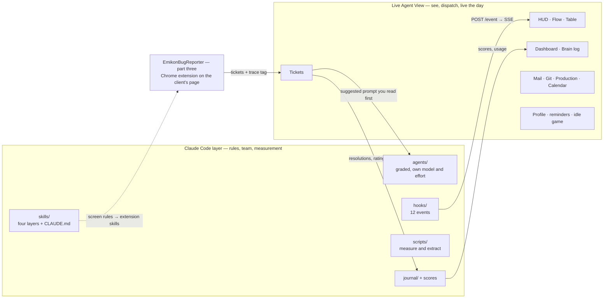
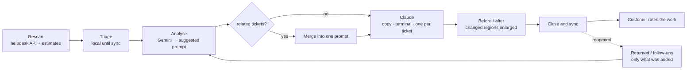
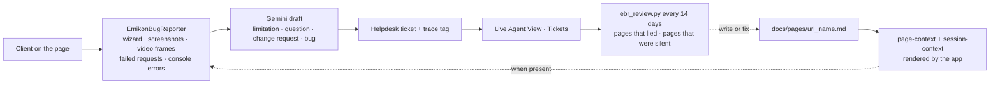
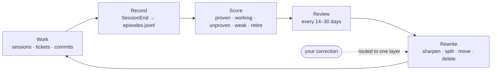

# brain

A portable engineering rule system for Claude Code: skills, a team of subagents,
hooks, workflows and measurement tools, carried across every machine and every
project in one git repo.

```bash
git clone https://github.com/BranislavCuturilo/BRAIN.git ~/.claude/skills/brain
```

That is the whole installation — it loads as the skills-directory plugin
`brain@skills-dir`, with no marketplace and no install step. Personal-scope
skills apply to **every project on the machine**, so there is never a per-project
clone.

## Start here

| | |
|---|---|
| **[Landing page](https://branislavcuturilo.github.io/BRAIN/)** | the method, Live Agent View and the ticket shift, drawn — `docs/index.html`, served by GitHub Pages |
| **[docs/SETUP.md](docs/SETUP.md)** | new machine, environment variables, what the hooks do, troubleshooting |
| **[docs/TESTING.md](docs/TESTING.md)** | the ordered path from "it exists" to "it works" |
| **[evals/README.md](evals/README.md)** | the regression suite for the brain itself — the two tiers, the five kinds |
| **[CLAUDE.md](CLAUDE.md)** | read every turn: this repo holds real customer data, and the three commands that verify |
| **[docs/AGENTS.md](docs/AGENTS.md)** | every agent: grade, model, what it preloads *(generated)* |
| **[docs/SKILLS.md](docs/SKILLS.md)** | every skill and its references *(generated)* |
| **docs/dashboard.html** | cost, real usage and recorded outcomes side by side *(generated)* |

Prose for a human reader sits beside the thing it describes:
[`skills/`](skills/README.md) · [`agents/`](agents/README.txt) ·
[`workflows/`](workflows/README.md) · [`scripts/`](scripts/README.md) ·
[`journal/`](journal/README.md)

## Three parts, one method

The Claude Code layer holds the rules and the team. Live Agent View is where they
are seen and carried out — the shift starts there, work is dispatched from there,
and what the work produced comes back through it. The third part,
[EmikonBugReporter](https://github.com/BranislavCuturilo/EmikonBugReporter), stands
on its own: a Chrome extension that lets a client report a bug from the page it
happened on, and works better the more the application declares about that page.



## The idea

A rule belongs to the **outermost layer where it is still true**:

| Layer | True for |
|---|---|
| `craft-*` | any language, forever |
| `stack-*`, `ui-*` | one technology |
| `arch-seams` | how two technologies meet |
| a project's own skills | one repository only |

**Few routers, unlimited references.** A skill's description is in context in
every session; a `references/*.md` file costs nothing until it is read. That one
constraint shapes the whole layout — see
[`skills/brain/references/splitting.md`](skills/brain/references/splitting.md).

**Agents cannot learn.** A subagent starts fresh every invocation and carries
only the skills named in its frontmatter. So teaching happens by **editing a
skill**, never by explaining — and the way to better junior work is more, narrower
juniors rather than smarter ones.

**Read before write.** A reader agent's context is thrown away, so it can read
1,500 lines and hand the writer a 30-line spec.

## What measures what

| Tool | Answers | Source |
|---|---|---|
| `scripts/brain/tests.py` | do the **scripts** still work | the 24 `test_*.py` files |
| `scripts/brain/evals.py` | do the **skills, hooks and routing** still fire | [`evals/`](evals/README.md) |
| `scripts/budget.py` | what it costs | the files |
| `scripts/brain/usage.py` | how often it is used | **counted** from session transcripts |
| `scripts/brain/delegation.py` | is it a swarm or a queue — fan-out width, nesting | the transcripts |
| `scripts/brain/coverage.py` | can each agent be REACHED when its case arrives | router + skills + workflows |
| `scripts/brain/score.py` | how well it worked | recorded by hand |
| `scripts/brain/outcomes.py` | what the **work** produced — rework, resolutions, rules | ticket store + worklog + git |
| `scripts/tickets/chain.py` | is one ticket's chain of artefacts complete | the ticket store |
| `scripts/tickets/similar.py` | have we already answered this ticket, and what did we say | the ticket store |
| `scripts/brain/episode.py` | what each session did — written automatically at SessionEnd | `journal/episodes.jsonl` |
| `scripts/brain/cadence.py` | which periodic review is overdue | `journal/cadence.json` |
| `scripts/brain/health.py` | is anything broken or stale | runs at session start, silent when fine |
| `scripts/brain/dashboard.py` | all of it, in one page | the above |
| `scripts/reach/reach.py` | what can be read OUTSIDE the repo, and which source answered | 7 keyless channels: search, SO, HN, GitHub, PyPI, RSS, web |
| `scripts/brain/bootstrap.py` | can this machine run the brain at all | the machine |
| `scripts/brain/detach.py` | run a long job so it CANNOT block you — own process, own worktree, wake lock | — |
| `scripts/seo.py` | what a marketing page is missing — only the CHECKABLE half | the page |
| `scripts/dead.py` | what in a folder nothing ANYWHERE reaches — candidates, never a verdict | the whole repo |
| `scripts/map/scan.py` | **a map of how a project fits together** — apps, imports, one self-contained HTML | the repository |
| `scripts/map/concept.py` | where a concept lives and what touches it | the repository |
| `scripts/brain/docs.py` | the catalogue tables | frontmatter |

A cheap agent nobody uses and an expensive one used constantly look identical in
any single table. That is why they are shown together.

**The first three are the gate.** `.github/workflows/brain.yml` runs
`tests.py`, `evals.py` and `health.py` on every push — no model, no key, no
tokens, so it is cheap enough to actually gate. Until that existed the brain
shipped governance as code while its own governance was advisory: `health.py`
ran on one machine, in `--quiet` mode, and nothing it reported could stop
anything.

**`evals/` is the piece with no substitute.** A skill can be rewritten into
something that no longer triggers, a hook's glob can stop matching the file it
was written for, a rule can quietly come to exist in two layers — and none of
those fails. They just stop working, and you find out from a ticket months
later. On its first run the suite found two live defects: the prompt router
missed the plainest phrasing of a cross-tenant question, and a test passed
everywhere except the machine that owned it.

## Live Agent View

[`agent_view/`](agent_view/README.md) is the other half: a local web app on the
Python standard library — `python agent_view/start.py`, port 7666, reachable from
a phone on the same LAN. Its screens are HUD, Table, Dashboard, Flow, Tickets,
Brain log, Git, Production, Mail, Profile and Calendar, plus voice commands through
Gemini, an idle game that quizzes you while Claude works, and a character that
keeps the water, stretching and exercise reminders.

The ticket shift it runs, every day:



## EmikonBugReporter — part three

A client sees `/xyz` on their site misbehave. Instead of going to the ticketing
system, they open [EmikonBugReporter](https://github.com/BranislavCuturilo/EmikonBugReporter)
on that page: a wizard (evidence, description, questions, draft, send) collects
screenshots, up to six video frames, the requests that failed or returned 4xx/5xx
and the console errors, and Gemini drafts the ticket into the helpdesk.

It works without any help from the application. It works much better when the
application declares each screen: the project keeps `docs/pages/<url_name>.md`
(what the screen does not allow, why, since when), and a context processor
renders it right after `<body>` as a `page-context` and a `session-context`
comment plus `data-page*` attributes. With that, a report asking for something
the page declares it does not allow (a `NE DOZVOLJAVA:` line, the keyword the
extension's parser matches) is a limitation by design, a missing right or
feature is a question, and only the rest is a bug — without it, the extension
never guesses intent or rights.



## Growing and pruning it



Rules arrive through `/brain:capture` at natural boundaries. A `SessionEnd` hook
records every session into `journal/episodes.jsonl` without being asked, and
`archivist` writes the *why* from that record rather than from memory — it had
been invoked zero times in 42 sessions because it needed someone to stop and
call it; `brain-keeper` audits for duplication,
contradiction and stale references; `/brain:ops-maintain` is the monthly cycle.

**A rule proven wrong is deleted in the same change that discovers it** — a
missing rule makes Claude ask, a wrong one makes it act. Never write a rule from
general knowledge: every rule here should trace to something that actually broke.

## Limits worth knowing

- `~/.claude/skills/` is **not** read by Cowork or cloud sessions.
- Project skills override same-named personal skills; plugin skills are
  namespaced and never collide.
- **This repository is named `.claude` but contains only the brain.** The rest of
  `~/.claude/` — `history.jsonl`, `sessions/`, `projects/*/memory`, `mcp.json` —
  must never be committed.

<!-- written by scripts/setup/generalise.py -->
## About the examples in this repository

Every rule here is followed by the incident that produced it — `**Where it
bit** — …`. **Those incidents are real; the names in them are not.**

The project names, hosts, ticket numbers and email addresses were replaced with
neutral ones (`acme`, `acme-audit`, `example.com`, `DEMO#12345`) before this
repository was published. What each rule says happened, happened. Where it says
it happened is a placeholder, so do not go looking for the repository or the
ticket — and do not treat a citation here as a source you can check.

The rule that produced this file is the same one the brain applies to itself: a
rule must trace to something that actually broke. Anonymising the coordinates
keeps the trace honest; deleting the citation entirely would leave rules that
read like general advice, which is the failure the whole system exists to
prevent.

